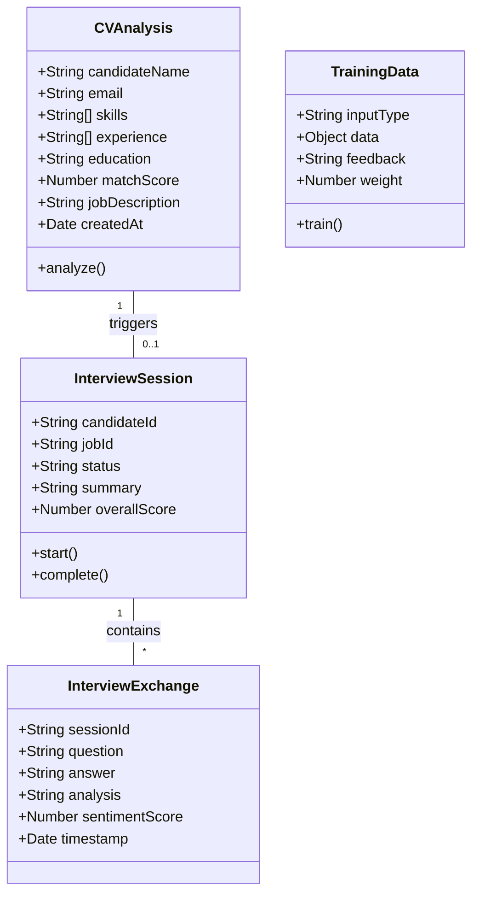
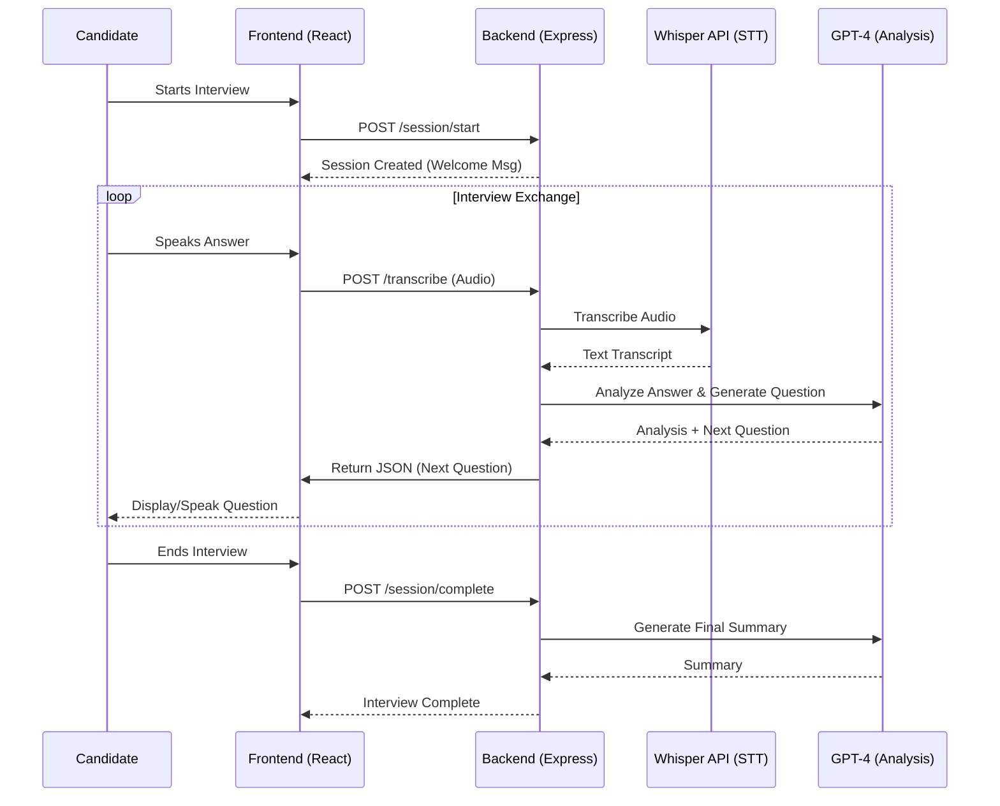
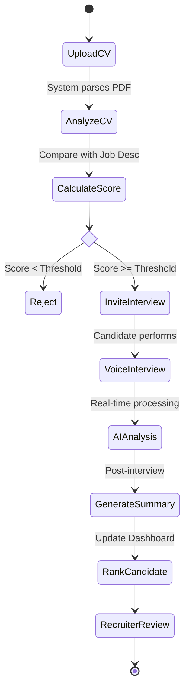
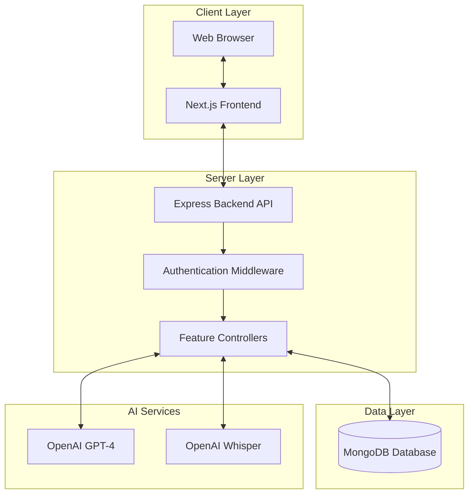

# Conception Diagrams - AI Recruitment Platform

## 1. Use Case Diagram

This diagram illustrates the main interactions between actors (Recruiter, Candidate) and the system's features.

```mermaid
usecaseDiagram
    actor "Recruiter" as R
    actor "Candidate" as C
    actor "System AI" as AI

    package "AI Recruitment Platform" {
        usecase "Upload & Analyze CV" as UC1
        usecase "View Recruiter Dashboard" as UC2
        usecase "Filter & Rank Candidates" as UC3
        usecase "Train ML Model" as UC4
        usecase "Perform Voice Interview" as UC5
        usecase "Generate Interview Summary" as UC6
    }

    R --> UC1
    R --> UC2
    R --> UC3
    R --> UC4
    C --> UC5
    
    UC1 ..> AI : Uses
    UC5 ..> AI : Uses
    UC6 ..> AI : Uses
    UC4 ..> AI : Refines
```

## 2. Class Diagram

Represents the data structure based on the Mongoose models found in `backend/models/new-features/`.



## 3. Sequence Diagram (Voice Interview Flow)

Details the interaction flow during an AI-driven voice interview.



## 4. Activity Diagram (Recruitment Process)

Shows the end-to-end workflow from application to final ranking.



## 5. Architecture Diagram

High-level conceptual architecture of the system components.


